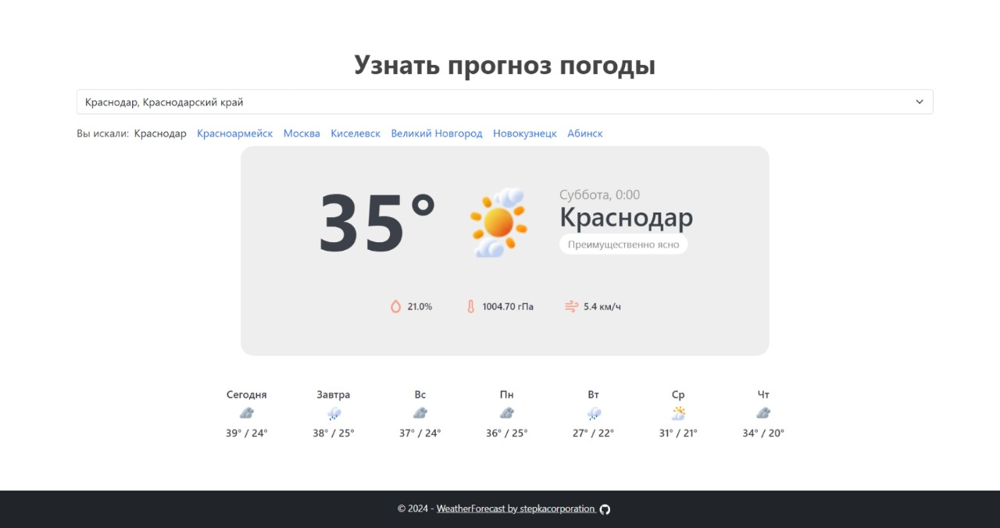

# Тестовое задание Python Developer

## Описание проекта

Данный проект представляет собой веб-приложение для прогнозирования погоды. Пользователь вводит название города и получает прогноз погоды на ближайшее время. Приложение выполнено с использованием Django и PostgreSQL и запускается через Docker Compose.

## Превью



## Реализованные требования

- Написаны тесты.
- Приложение помещено в Docker-контейнер и запускается с помощью Docker Coompose.
- Реализовано автодополнение (подсказки) при вводе города.
- При повторном посещении сайта решил вместо подсказки сразу загружаеть погоду по тому городу, в котором пользователь уже смотрел ранее, при этом всё также отображается история поиска.
- Сохраняется история поиска в cookie (последние 7 запросов), а также реализовано API, показывающее сколько раз вводили какой город.

## Использованные технологии

- **Django**: Веб-фреймворк для разработки приложения.
- **PostgreSQL**: Система управления базами данных для хранения информации.
- **Docker**: Платформа для контейнеризации приложения.
- **Docker Compose**: Инструмент для запуска многоконтейнерных приложений.

## Запуск проекта

1. **Клонируйте репозиторий**:

```bash
git clone https://github.com/stepkacorporation/weather_forecast.git
cd weather_forecast
```

2. **Настройте Docker Compose**:

Убедитесь, что у вас установлен Docker и Docker Compose.

3. **Запустите контейнеры**:

```bash
docker-compose up -d --build
```

4. **Загрузите данные о городах**:

После запуска контейнеров необхоимо выполнить загрузку данных о городах России.

```bash
docker-compose exec web python manage.py load_cities
```

5. **Создайте суперпользователя (опционально)**:

```bash
docker-compose exec web python manage.py createsuperuser
```

6. **Откройте веб-приложение**:

Перейдите по адресу [http://localhost:8000](http://localhost:8000) в вашем браузере.  
Админ-панель доступна по адресу [http://localhost:8000/admin](http://localhost:8000/admin).  
API: [http://localhost:8000/api/v1/cities/search-count/](http://localhost:8000/api/v1/cities/search-count/).

## Тестирование

Для выполнения тестов используйте команду:

```bash
docker-compose exec web python manage.py test
```
